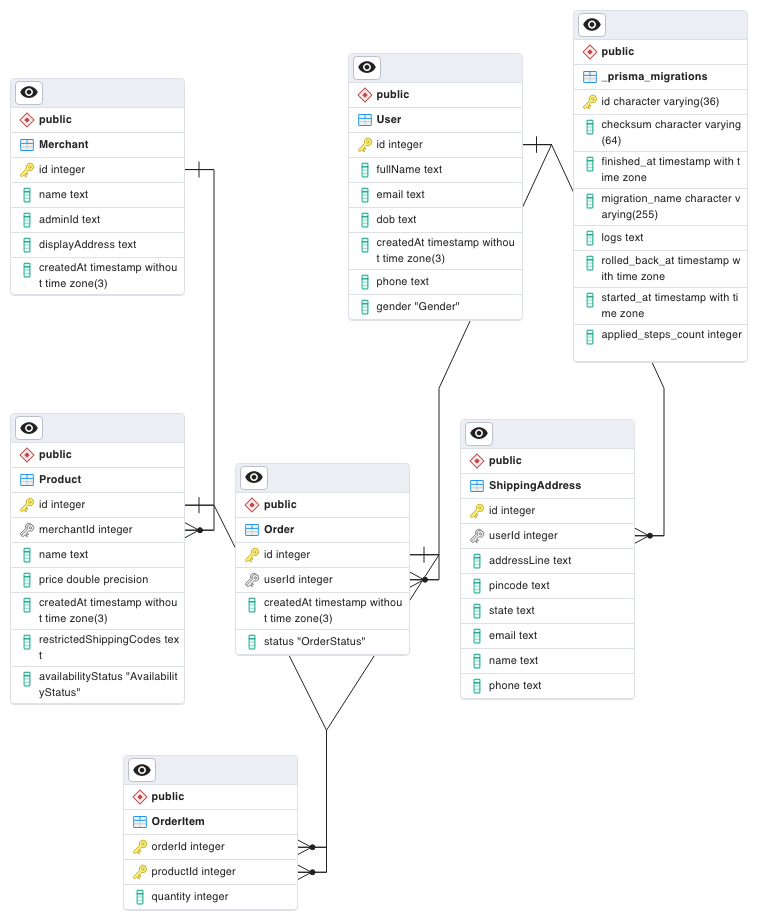

## Brief
Cart SaaS project is all about creating a cart product which can be integrated in any e-commerce product.

This repository is to hold the backend API design and code for the Cart Product.
## First steps first
### UML Design
**Up to date** @: 

### How to run the app for the first time (in development environment)
- Install all the dependent packages using `npm install`.
- Create environment variables in production environment or `.env` file using `.env.example` in development environment.
- Make sure you have started the postgresql server whose url you kept in `.env`'s `DB_URL`. (To avoid manual postgres installation, use [docker service](#docker-compose-services))
- Run `npm run prisma-migrate` to setup your database (with the required tables).
- Run `npm run prisma-seed` to fill in example data to the tables (only run if necessary) (**Node**: Skip this, since its WIP.)
- Finally, run `npm run start` (for production environment) or `npm run dev` (for development).
- Your app would be running on the defined port.

### Docker compose services
To avoid manual setup, we have `docker-compose.yaml` which will help you run docker container with all the required services.
- Make sure you have installed docker and its running.
- Run the command `npm run container-services` to start the dependent services (postgres).
- Run `npm run stop-container-services` to stop the services.
- You can see if any of the docker services are running with `npm run check-running-services`.

### Generate Swagger API Docs
- To auto-generate Swagger Docs, use `npm run generate:doc`.
- This will generate `swagger.json`.
- Now, when you run the app (either using `npm run start` or `npm run dev`) and go to `/api-docs` on browser, you can find the Swagger API Doc.

**Note**: Every time you change API routes, make sure to generate swagger API docs to keep it up-to-date.

### ExpressJS template code
This app's starter code is generated using [ExpressJS template](https://expressjs.com/en/starter/generator.html) and EJS for views.